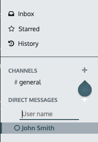

## Get Started with CONNECT

CONNECT allows you to bring all of your company’s communication together through messages, notes, and chat. Share information, projects, files, prioritize tasks, and stay connected with colleagues and partners throughout applications. Forge better relationships, increase productivity and transparency by promoting a convenient way of communicating.

### Choose your notifications preference

Access your Preferences and choose how you would like your notifications to be handled.
 

 

By default, the field is set as _Handle by Emails_ making messages, notes, and notifications where you were mentioned or that you follow, to be sent through email. By choosing _Handle in PerfectWORK_, they are shown in the _Inbox_.
  
Messages can then be Marked as Todo, Replied, or Marked as Read.

### Start Chatting

The first time you log in to your account, PWBot sends you a message asking for permission to receive desktop notifications to chats. If accepted, you receive push notifications to the messages sent to you despite of where you are in PerfectWORK.

!!!Tip
    To stop receiving desktop notifications, reset the notifications settings of your browser.

To start a chat, click on _New Message_ on the Messaging Menu, or go to **Connect** and send a _Direct Message_.
 

 
You can also create [public and private channels](#Public and Private channels).

#### Mentions in the chat and on the Chatter
To mention a user within a chat or the chatter type _@user-name_; to refer to a channel, type _#channel-name_.
A notification is sent to the user mentioned either to his _Inbox_ or through email, depending on his settings.

!!!Tip
    When a user is mentioned, the search list (list of names) suggests values first based on the task’s followers, and secondly on Employees. If the record being searched does not match with either a follower or employee, the scope of the search becomes all partners.

#### Chat status
It is helpful to see what colleagues are up to and how quickly they can respond to messages by checking their Status. The status is shown on the left side of a contact’s names on Discuss’ sidebar and on the Messaging menu.

- Green = online
- Orange = away
- White = offline
- Airplane = out of the office

## Efficiently Communicate Using Channels
You can use channels to organize discussions between individual teams, departments, projects, or any other group that requires regular communication. This way, you keep everyone in the loop updated with the latest developments.

### Public and Private channels
A Public channel can be seen by everyone, while a Private one is only visible to users invited to it.

!!!Tip
    A public channel is best used when many employees need to access information (such as company announcements), whereas a private channel could be used whenever information should be limited to specific groups (such as a specific department).

#### Configuration options
You can configure a channel’s name, description, email alias, and privacy by clicking on the Channel Settings icon on the sidebar.

##### Privacy and Members
Changing _Who can follow the group’s activities_? allows you to control which groups can have access to the channel. Note that allowing Everyone to follow a private channel lets other users view and join it, as they would a public one.
  
If you choose _Invited people only_, go to the Members tab to add your members, or, go to Connect’ main page, select the channel and click on _Invite_.
  
For _Selected group of users_, the option _Auto Subscribe Groups_ automatically add its members as followers. In other words, while _Authorized Groups_ limits which users can access the channel, _Auto Subscribe Groups_ automatically adds the user as a member as long as they are part of the group.

#### Use a channel as a mailing list
Choosing to _Send messages by email_ configures the channel to behave as a mailing list.
  
Enabling this option allows you to _Moderate this channel_, meaning that messages will need to be approved before being sent.
  
Under the _Moderation_ tab choose as many moderators as you need, and if you would like them to receive an _Automatic notification_.
  
Mark _Send guidelines_ to new _subscribers_ to automatically send instructions to newcomers.
  
Moderators can: Accept, Reject, Discard, Always Allow or Ban messages.
  
!!!Note
    Members of a mailing channel receive messages through email regardless of their [notification preference](#choose-your-notifications-preference).
Once a channel is moderated, the menu Ban List allows you to add email addresses per moderated channel to auto-ban them from sending messages.

### Quick search bar
Once at least 20 channels, direct message and live chat conversations (if the module is installed on your database) are pinned in the sidebar, a Quick search… bar is displayed. It is a clever way to filter conversations and quickly find the one you need.

#### Finding channels
Click on _Channels_ (on the sidebar), browse through the list of public channels, and join or leave them from a single screen.
Apply filters criteria and save it for later use. The search function accepts wildcards by using the underscore character _(_)_ to represent a single character.

## Get Organized by Planning Activities
When you plan activities you minimize the risk of uncertainties, as you provide clear directions for the course of your next action. In addition to that, you do not leave space for wasteful activities and reduce the chance of having overlapping actions between team members.

### Where do I see my schedule activities?
Access and manage your activities wherever you are in PerfectWORK by the Activities menu.

### Plan activities
Activities can be planned and managed from the chatter by clicking on Schedule activity, or through Kanban views.

#### Set your activity types
A number of activities types are available by default in PerfectWORK (call, email, meeting, etc.). However, you can set new ones going to Settings ‣ Activity types.

!!!Tip
    If you need to create an activity type with an available calendar, make sure to create it with an Action to Perform set as Meeting.

#### Recommend next activities
PerfectWORK helps you to plan a flow of activities by allowing you to set Recommended Next Activities.
  
Once the respective activity is completed, select _Done & Schedule Next_ and next steps are suggested to you.

