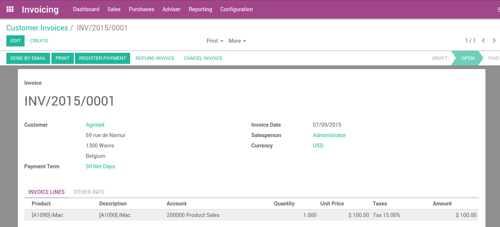
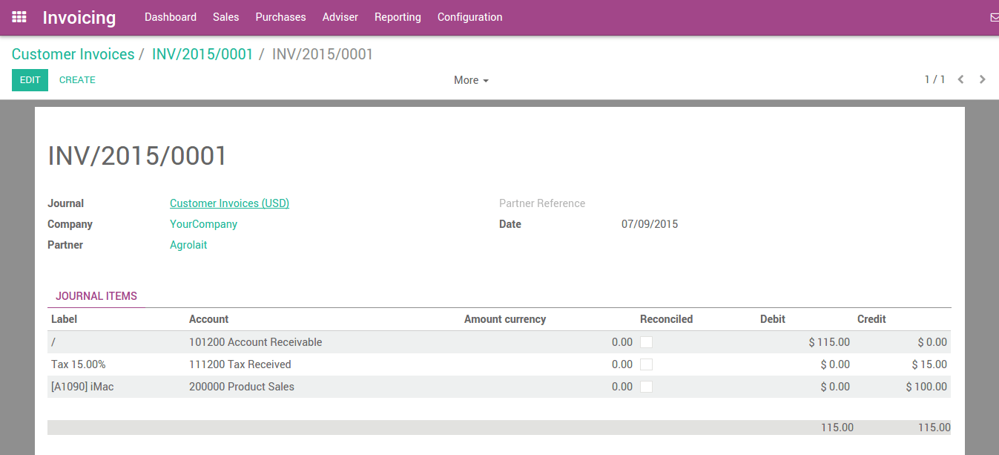
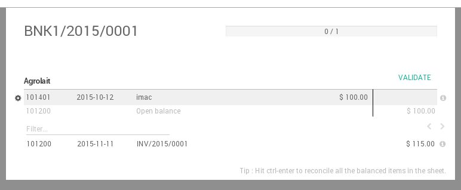
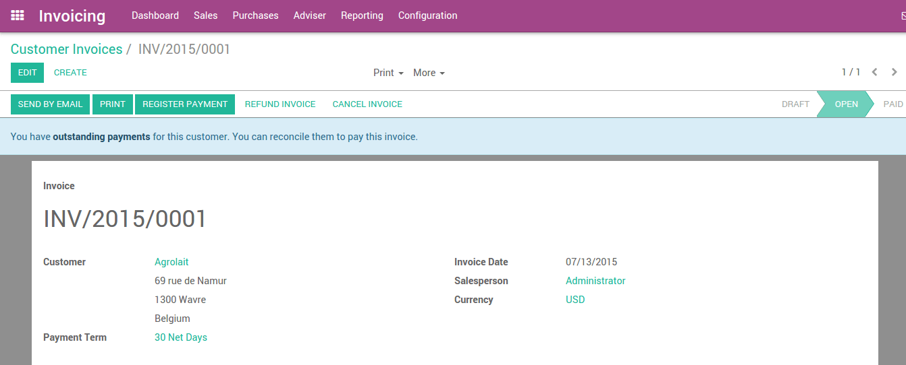
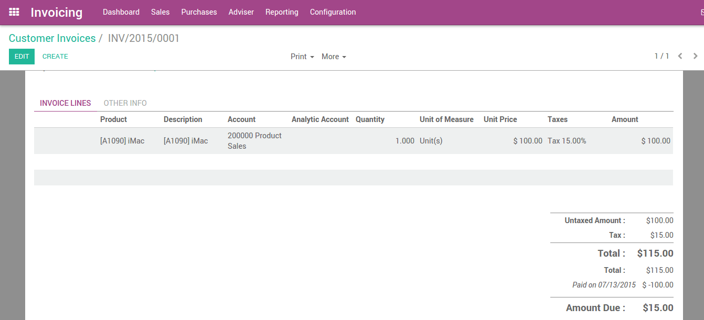
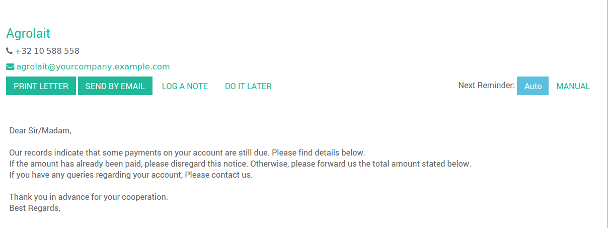
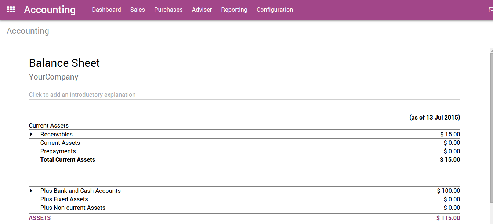
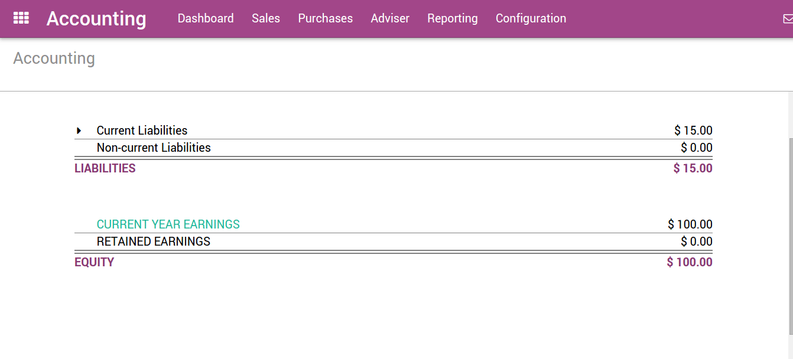

PerfectWORK supports multiple invoicing and payment workflows, so you can choose and use the ones that match your business needs. Whether you want to accept a single payment for a single invoice, or process a payment spanning multiple invoices and taking discounts for early payments, you can do so efficiently and accurately.

## From Draft Invoice to Profit and Loss
If we pick up at the end of a typical ‘order to cash’ scenario, after the goods have been shipped, you will: issue an invoice; receive payment; deposit that payment at the bank; make sure the Customer Invoice is closed; follow up if Customers are late; and finally present your Income on the Profit and Loss report and show the decrease in Assets on the Balance Sheet report.

Invoicing in most countries occurs when a contractual obligation is met. If you ship a box to a customer, you have met the terms of the contract and can bill them. If your supplier sends you a shipment, they have met the terms of that contract and can bill you. Therefore, the terms of the contract is fulfilled when the box moves to or from the truck. At this point, PerfectWORK supports the creation of what is called a Draft Invoice by Warehouse staff.

## Invoice creation
Draft invoices can be manually generated from other documents such as Sales Orders, Purchase Orders,etc. Although you can create a draft invoice directly if you would like.

An invoice must be provided to the customer with the necessary information in order for them to pay for the goods and services ordered and delivered. It must also include other information needed to pay the invoice in a timely and precise manner.

## Draft invoices
The system generates invoice which are initially set to the Draft state. While these invoices

remain unvalidated, they have no accounting impact within the system. There is nothing to stop users from creating their own draft invoices.

Let’s create a customer invoice with following information:

- Customer: Agrolait
- Product: iMac
- Quantity: 1
- Unit Price: 100
- Taxes: Tax 15%

The document is composed of three parts:

- the top of the invoice, with customer information,
- the main body of the invoice, with detailed invoice lines,
- the bottom of the page, with detail about the taxes, and the totals.

## Open or Pro-forma invoices
An invoice will usually include the quantity and the price of goods and/or services, the date, any parties involved, the unique invoice number, and any tax information.

“Validate” the invoice when you are ready to approve it. The invoice then moves from the Draft state to the Open state.

When you have validated an invoice, PerfectWORK gives it a unique number from a defined, and modifiable, sequence.

Accounting entries corresponding to this invoice are automatically generated when you validate the invoice. You can see the details by clicking on the entry in the Journal Entry field in the “Other Info” tab.

## Send the invoice to customer
After validating the customer invoice, you can directly send it to the customer via the ‘Send by email’ functionality.

A typical journal entry generated from a validated invoice will look like as follows:

| Account | Partner | Due Date | Debit | Credit |
|---------|---------|----------|-------|--------|
|Account Receivable | Agrolait | 01/07/2021 | 115 | |
|Taxes | Agrolait| | | 15 |
|Sales | | | | 100 |

## Payment
In PerfectWORK, an invoice is considered to be paid when the associated accounting entry has been reconciled with the payment entries. If there has not been a reconciliation, the invoice will remain in the Open state until you have entered the payment.

A typical journal entry generated from a payment will look like as follows:

| Account | Partner | Due Date | Debit | Credit |
|---------|---------|----------|-------|--------|
|Bank | Agrolait | 01/07/2021 | 115 | |
|Accounts Receivable | Agrolait | 01/07/2021 |  | 115 |

## Receive a partial payment through the bank statement
You can manually enter your bank statements in PerfectWORK, or you can import them in from a csv file or from several other predefined formats according to your accounting localisation.

Create a bank statement from the accounting dashboard with the related journal and enter an amount of $100 .

## Reconcile
Now let’s reconcile!

You can now go through every transaction and reconcile them or you can mass reconcile with instructions at the bottom.

After reconciling the items in the sheet, the related invoice will now display “You have outstanding payments for this customer. You can reconcile them to pay this invoice. “

Apply the payment. Below, you can see that the payment has been added to the invoice.

## Payment Followup
There’s a growing trend of customers paying bills later and later. Therefore, collectors must make every effort to collect money and collect it faster.

PerfectWORK will help you define your follow-up strategy. To remind customers to pay their outstanding invoices, you can define different actions depending on how severely overdue the customer is. These actions are bundled into follow-up levels that are triggered when the due date of an invoice has passed a certain number of days. If there are other overdue invoices for the same customer, the actions of the most overdue invoice will be executed.

By going to the customer record and diving into the “Overdue Payments” you will see the follow-up message and all overdue invoices.

### Customer aging report:
The customer aging report will be an additional key tool for the collector to understand the customer credit issues, and to prioritize their work.

Use the aging report to determine which customers are overdue and begin your collection efforts.

## Profit and loss

The Profit and Loss statement displays your revenue and expense details. Ultimately, this gives you a clear image of your Net Profit and Loss. It is sometimes referred to as the “Income Statement” or “Statement of Revenues and Expenses.”

## Balance sheet
The balance sheet summarizes your company’s liabilities, assets and equity at a specific moment in time.

For example, if you manage your inventory using the perpetual accounting method, you should expect a decrease in account “Current Assets” once the material has been shipped to the customer.