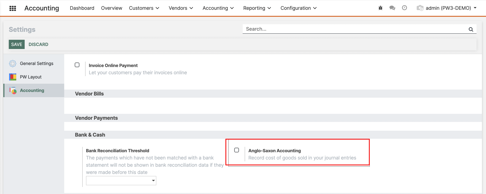

There are mainly two types of accounting practices that are widely adopted across the world. Everyone is familiar with continental accounting as this is one of the widely used accounting features especially in European countries. Anglo Saxon accounting, on the other hand, is used by a other community.

In Continental Accounting, the **expense account** is affected at the **time of purchase** on the other hand, in Anglo Saxon Accounting the **expense account** is affected at the **time of processing a sales order**. Let's now look at both Continental and Anglo-Saxon accounting in detail.

## How to configure Continental or Anglo-Saxon Accounting

For implementing the continental accounting, go to the settings menu of the accounting module, untick the checkbox (by default it will be continental) Anglo-Saxon Accounting, and save changes.
  

  
If you would like to use Angle Saxon accounting, just tick the checkbox Anglo-Saxon Accounting, then save changes.