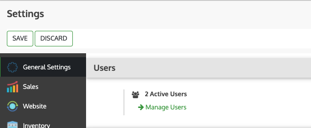
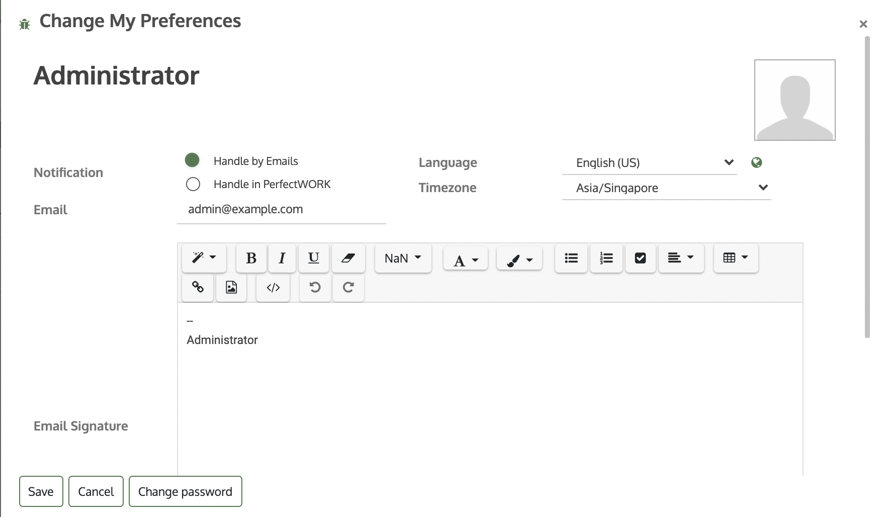
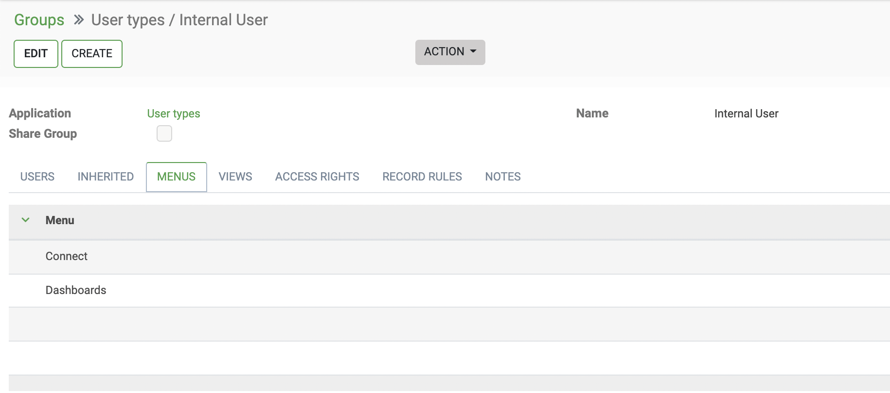

## Managing Users

PerfectWORK defines a user as someone who has access to a database to perform daily tasks. You can add as many users as you need and, in order to restrict the type of information each user can access, rules can be applied. Users and access rights can be added and changed at any point of time.

???+ note "See Also"

    - [Change Language](/gethelp/01_user_guide/platform/modules/)
    - [Access Right](#access-right)
  
### Add individual users

Go to **Settings** ‣ **Manage Users** and click on _Create_.
 
<figure markdown> <!-- 
 -->
  { width="500" loading=lazy }
  <figcaption></figcaption>
</figure>
 
Fill in the form with the needed information. Under the tab [Access Right](#access-right) choose the group within each application the user can have access to.
The list of applications shown is based on the applications installed on the database.

 

<figure markdown> <!-- 
 -->
  { width="800" loading=lazy }
  <figcaption></figcaption>
</figure>
 
When you are done editing the page and have Saved it, an invitation email is automatically sent to the user. The user must click on it to accept the invitation and create a login.

### Deactivate users

Go to **Settings** ‣ **Users & Companies** ‣ **Users**, open the user you want to deactivate, click on _Action_, and then on _Archive_.

!!! danger "Danger" 

    **NEVER** deactivate the main user (admin)

### Passwords Management

#### Reset Password

##### Enable password resets from login page

It is possible to enable password resets directly from the login page.

To do so, go to **Settings** ‣ **General Settings**, Under _Users_ Tab, activate **Password Reset** and _Save_.
 
{ width="800" loading=lazy }
 

#### Send reset instructions to users

Go to **Settings** ‣ **Users & Companies** ‣ **Users**, select the user out of the list and click on _Send Password Reset Instructions_ on its user form. An email is automatically sent to them.
!!! note 
    The _Send Password Reset Instructions_ button only appears if the PerfectWORK invitation email has already been confirmed by the user.

This email contains all the instructions needed to reset the password, along with a link redirecting the user to an PerfectWORK login page.

#### Change users’ passwords

Go to **Settings** ‣ **Users & Companies** ‣ **Users** and select a user to access its form. Click on the _Action_ button and select _Change Password_.

 

{ width="800" loading=lazy }

 

Enter a new password and confirm by clicking on _Change Password_.

!!! note
    
    This operation only modifies the password of the users locally and does not affect their odoo.com account. If you want to change the odoo.com password, you can **send the password reset instructions**.

#### Multi Companies

The _Multi Companies_ field allows you to set to which of the multiple companies database you hold the user can have access.

!!! note
    Note that if not handled correctly, it may be the source of a lot of inconsistent multi-company behaviors. Therefore, a good knowledge of PerfectWORK is required. For technical explanations refer to [multi-company Guidelines](/gethelp) documentation.

!!! info "See Also"

    - [Companies](/gethelp/user_guide/platform/companies/){ width="800" loading=lazy }
  

## Change Language

PerfectWORK provides you with the option to manage PerfectWORK in different languages, and each user can use PerfectWORK in his own language.

 

### Load your desired language
The first thing to do is to load your desired language on your PerfectWORK database.

From the general dashboard click on the **Settings** app; on the top left of the page select **Translations** ‣ **Laungauges**, select a language to install and click on **LOAD**.

 

{ width="800" loading=lazy }

 

''' note
    If you check the “Websites to translate” checkbox you will have the option to change the navigation language on your website.

### Change your language

User can change the language to the installed language by going to the drop-down menu at the top right side of the screen, choose **Preferences**.

 

 

Then change the Language setting to your installed language and click SAVE.

### Change other user's language

PerfectWORK also gives you the possibility for each user to choose his preferred language.

To change the language for a different user, choose **Users** ‣ **Users** from the Settings app. Here you have a list of all users and you can choose the user who you’d like to change the language for. Select the user and click on **Edit** in the top left corner. Under Preferences you can change the Language to any previously installed language and click **SAVE**.

 

## Access Right

Activate the _developer mode_, then go to **Settings** ‣ **Users & Companies** ‣ **Groups**.

### Groups

When choosing the groups the user can have access under **Access Rights**, details of the rules and inheritances of that group are not shown, so this is when the menu _Groups_ comes along. Groups are created to define rules to models within an application.

 

Under _Users_, have a list of the current ones. The ones with internal user access are shown in black.

 

 

_Inherited_ means that users added to this application group are automatically added to the following ones. In the example below, users who have access to the group _Extra Right / Technical Features_ also have access to _Internal User_ group

 

 

!!! important
    Remember to always test the settings being changed in order to ensure that they are being applied to the needed and right users.

The Menus tab is where you define which menus (models) the user can have access to.

 

 

_Access Rights_ rules are the first level of rights. The field is composed of the object name, which is the technical name given to a model. For each model, enable the following options as appropriate:

- Read: the values of that object can be only seen by the user.
- Write: the values of that object can be edited by the user.
- Create: values for that object can be created by the user.
- Delete: the values of that object can be deleted by the user.

 

 

As a second layer of editing and visibility rules, _Record Rules_ can be formed. They overwrite, or refine, the _Access Rights_.

 

A record rule is written using a _Domain_. Domains are conditions used to filter or searching data. Therefore, a domain expression is a list of conditions. For each rule, choose among the following options: _Read_, _Write_, _Create_ and _Delete_ values.

 

 

!!! important

    Making changes in access rights can have a big impact on the database. For this reason, we recommend you to contact your PerfectWORK Consultants or our Support Team, unless you have knowledge about Domains in PerfectWORK.

